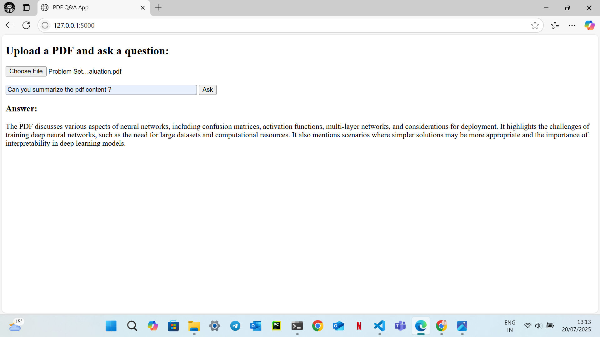

<<<<<<< HEAD
# 🧠 PDF Semantic Search Q&A App (Flask + LangChain + AWS + OpenAI)

This project demonstrates a **cloud-native Generative AI architecture** using AWS and OpenAI. It supports **retrieval-augmented generation (RAG)** pipelines where users can upload their own PDFs and ask natural-language questions grounded in those documents.

✅ Integrated with:
- 🐍 **Flask** — for the web UI and backend
- 🌩️ **AWS S3** — for storing uploaded PDF files
- ☁️ **AWS SageMaker** — for generating text embeddings using Cohere model (1024-dim)
- 🔍 **Chroma VectorDB** — for fast vector search on document chunks
- 🤖 **OpenAI GPT-3.5** — for generating grounded answers from context
- 🧱 **LangChain Framework** — for orchestrating document loaders, chunking, retrievers, and LLM chains

---

## 🔧 Features

- Upload any PDF file securely to the cloud
- Ask a question about its content in natural language
- Get a context-referenced answer, automatically processed via vector search and LLM reasoning
- Semantic embeddings generated using your own SageMaker endpoint with Cohere (1024-dim)
- Top-k relevant chunks fetched via **ChromaDB**
- Final answer generated using **OpenAI GPT-3.5**, grounded in vector-retrieved context

---
## 🖼️ Demo

The screenshot below shows the user interface for uploading a PDF and asking questions. The app leverages LangChain, AWS SageMaker embeddings, Chroma vector search, and OpenAI LLM for robust document Q&A.

## 🧱 Architecture Diagram

---

 
                +-------------------+
                |    User Uploads   |
                |   PDF + Question  |
                +--------+----------+
                         |
                         v
                +--------+----------+
                |       Flask        |
                | Web Interface/API  |
                +--------+----------+
                         |
           +-------------+-------------+
           |                           |
           v                           v
  +--------+--------+         +--------+--------+
  |   AWS S3 Bucket  |         |  User Question  |
  | Stores PDFs      |         | from UI         |
  +--------+--------+         +--------+--------+
           |                           |
           v                           |
+----------+-----------+              |
|   PDF Loader +       |              |
|   Chunking (LangChain)|             |
+----------+-----------+              |
           |                          |
           v                          |
+----------+-----------+              |
|   Cohere Embed via    |             |
| SageMaker Endpoint    |             |
+----------+-----------+              |
           |                          |
           v                          |
  +--------+--------+                 |
  |  Chroma VectorDB |  <-------------+
  |  (local storage) |
  +--------+--------+
           |
           v
+----------+-----------+
|  Document Retriever  |
|  (top-k similarity)  |
+----------+-----------+
           |
           v
+----------+-----------+
|   OpenAI GPT-3.5     |
|   Answer Generator   |
+----------+-----------+
           |
           v
      Final Answer

## 🚀 Setup

### 1. Clone the repo
git clone https://github.com/Sivasankari199/flask-langchain-qa.git
cd flask-langchain-qa

### 2. Create a `.env` File

Create a file called `.env` in the root of your project folder:

OPENAI_API_KEY=sk-xxxxxxxxxxxxxxxxxxxxxxxxxxxxxxxx
AWS_REGION=eu-north-1
SAGEMAKER_ENDPOINT=your sagemaker endpoint
S3_BUCKET=your bucket name

✅ This file is ignored by Git and should **never be pushed to GitHub**.

### 3. Install Python Dependencies

Make sure your Python environment (e.g., `myqaenv`) is activated, then run:

pip install -r requirements.txt

### 4. Configure AWS CLI

Run once on your system:
aws configure

Enter your AWS access credentials and region.

---

### 5. Run the App
python app.py

Open your browser and go to:

📍 `http://127.0.0.1:5000`

---

## 📁 Project Structure
flask-langchain-qa/
├── app.py
├── .env 
├── requirements.txt
├── .gitignore
├── README.md
├── templates/
│ └── index.html
└── static/
└── uploads/ 
=======
# flask-langchain-qa
Flask web app for question answering on PDF documents using LangChain, Chroma (vector DB), OpenAI LLM, and AWS SageMaker embeddings. Upload PDFs and get instant, context-aware answers.
>>>>>>> ba7735bfa3dfb9fe8c4956c5ad0b8ceacbfe0a61
